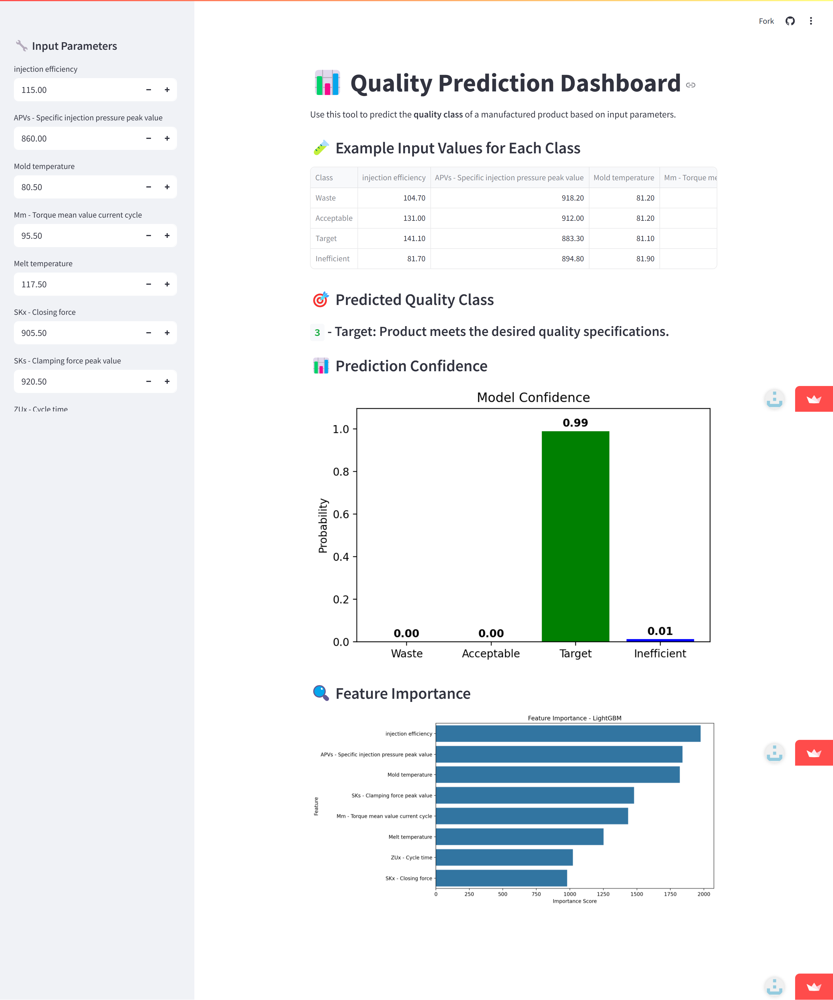

# Streamlit Quality Dashboard (LightGBM)

[](LICENSE)
[](https://app-quality-dashboard-xzktf8sfvx8s7utc6cid2f.streamlit.app)

## 🔎 Introduction
In manufacturing, defective products lead to significant waste and costs.  
Traditional quality checks are performed **after production**, which is inefficient and expensive.  

This project demonstrates how **machine learning** can be applied to predict product quality in real time, using process parameters such as temperature, pressure, and cycle time.  
A complete **end-to-end ML pipeline** was designed, tested, and deployed as an interactive dashboard for proactive quality control.

---

## 🔬 Machine Learning Pipeline
- **Data preprocessing**: Winsorization and normalization to handle outliers and ensure consistent scaling.  
- **Feature engineering**: Derived variables such as *Injection Efficiency* and *Torque Stability*.  
- **Feature selection**: ANOVA used to identify the most relevant predictors.  
- **Model training**: Five algorithms tested — Random Forest, SVM, AdaBoost, LightGBM, and ANN.  
- **Hyperparameter tuning**: GridSearchCV with 3-fold cross-validation.  
- **Evaluation metrics**: Accuracy, ROC-AUC, F1-score, and confusion matrices.  

---

## 📊 Results
After testing multiple models, **LightGBM achieved the best performance**:

- Accuracy: **94.5%**  
- ROC-AUC: **0.9945**

Other models such as Random Forest and SVM also performed well, but LightGBM consistently outperformed them across all metrics, making it the most reliable choice for deployment.

---

## 🚀 Deployment
The **LightGBM model** was integrated into an interactive dashboard built with **Streamlit**, turning a research pipeline into a **practical tool for engineers and decision-makers**.  

With the dashboard, users can:  
- Enter process parameters to generate predictions  
- Classify outputs as **Waste, Acceptable, Target, Inefficient**  
- View **prediction probabilities**  
- Explore **feature importance**

👉 [Open the Dashboard](https://app-quality-dashboard-xzktf8sfvx8s7utc6cid2f.streamlit.app)

---

## 🖼️ Screenshot


---

## 📂 Project Structure

## Project Structure
```
streamlit-quality-dashboard/
├── app/                # Streamlit app (dashboard.py)
├── notebooks/          # Jupyter notebooks (EDA, model training)
├── data/               # Sample dataset (small example only)
├── images/             # Screenshots for the README
├── src/                # Helper functions (inference, utils)
├── lightgbm_model.pkl  # Pretrained LightGBM model
├── requirements.txt    # Python dependencies
├── LICENSE             # MIT License
└── README.md           # Project documentation
```

---

## ⚙️ Quickstart

```bash
# 1. Create a virtual environment
python -m venv .venv

# 2. Activate it
# On Windows
.venv\Scripts\activate
# On Linux / Mac
source .venv/bin/activate

# 3. Install dependencies
pip install -r requirements.txt

# 4. Run the app
streamlit run app/dashboard.py
```

The app will launch locally at: http://localhost:8501

---

## License
This project is licensed under the MIT License – see the [LICENSE](LICENSE) file for details.
